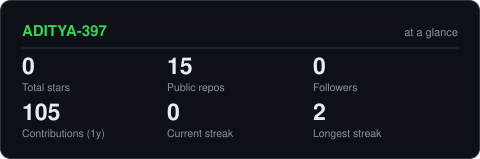
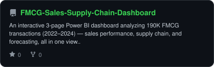
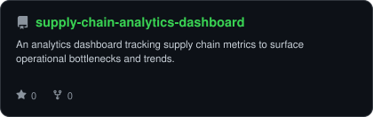
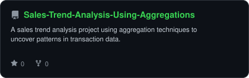
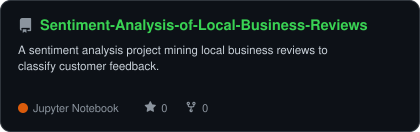

<div align="center">

<!-- PORTRAIT - generated by scripts/dotify.py from assets/jacket.png.
     Colour mode, so one file serves both GitHub themes. Regenerate with:
       python scripts/dotify.py assets/jacket.png -o assets/portrait \
         --cols 100 --equalize --detail 0.5 --color -->


<br>

<!-- NAME / TAGLINE - animated typing -->
<a href="https://github.com/ADITYA-397">
  
</a>

<br>

<!-- SOCIALS -->

<a href="https://linkedin.com/in/adityakdm1"></a>
<a href="mailto:adityakdm3251@gmail.com"></a>
<a href="https://adityakadam.co.in"></a>


</div>

---

## `~/` whoami

```console
$ cat about.txt
```

Hi, I'm **Aditya**. I work with data — building dashboards, models, and decision-support tools that turn numbers into something people can actually act on.

- Portfolio: **[adityakadam.co.in](https://adityakadam.co.in)**
- Learning **Advanced DAX & Power BI Data Modeling**
- Fun fact: **I've built more dashboards than presentations I've actually given.**

<br>

<div align="center">

## `~/` toolbox

<p align="center">


</p>

</div>

---

<div align="center">

## `~/` skill radar

<table>
<tr>
<td width="50%" align="center" valign="middle">

<!-- Self-rated radar - edit assets/skills.json, the workflow redraws it -->
<picture>
  <source media="(prefers-color-scheme: dark)"  srcset="assets/radar-dark.svg">
  <source media="(prefers-color-scheme: light)" srcset="assets/radar-light.svg">
  
</picture>

</td>
<td width="50%" align="center" valign="middle">

<!-- Live radar built from real language byte counts across your repos -->
<picture>
  <source media="(prefers-color-scheme: dark)"  srcset="assets/radar-langs-dark.svg">
  <source media="(prefers-color-scheme: light)" srcset="assets/radar-langs-light.svg">
  
</picture>

</td>
</tr>
</table>

</div>

---

<div align="center">

## `~/` contribution calendar

<!-- 3D isometric calendar, regenerated every 6h by .github/workflows/metrics.yml -->


<br><br>

<!-- Snake eats the contribution graph - .github/workflows/snake.yml -->
<picture>
  <source media="(prefers-color-scheme: dark)"  srcset="https://raw.githubusercontent.com/ADITYA-397/ADITYA-397/output/snake-dark.svg">
  <source media="(prefers-color-scheme: light)" srcset="https://raw.githubusercontent.com/ADITYA-397/ADITYA-397/output/snake.svg">
  
</picture>

</div>

---

<div align="center">

## `~/` the numbers

<!-- Generated by scripts/cards.py into this repo. Deliberately NOT
     github-readme-stats / streak-stats / github-profile-trophy: those are
     shared public instances that go down and take the whole section with them. -->
<picture>
  <source media="(prefers-color-scheme: dark)"  srcset="assets/card-stats-dark.svg">
  <source media="(prefers-color-scheme: light)" srcset="assets/card-stats-light.svg">
  
</picture>

<br>


<br><br>


</div>

---

<div align="center">

## `~/` selected work

<!-- Cards generated by scripts/cards.py from assets/projects.json.
     Stars, forks and language are pulled live from the API on every run. -->
<table>
<tr>
<td width="50%">
  <a href="https://github.com/ADITYA-397/FMCG-Sales-Supply-Chain-Dashboard">
    <picture>
      <source media="(prefers-color-scheme: dark)"  srcset="assets/card-FMCG-Sales-Supply-Chain-Dashboard-dark.svg">
      <source media="(prefers-color-scheme: light)" srcset="assets/card-FMCG-Sales-Supply-Chain-Dashboard-light.svg">
      
    </picture>
  </a>
</td>
<td width="50%">
  <a href="https://github.com/ADITYA-397/supply-chain-analytics-dashboard">
    <picture>
      <source media="(prefers-color-scheme: dark)"  srcset="assets/card-supply-chain-analytics-dashboard-dark.svg">
      <source media="(prefers-color-scheme: light)" srcset="assets/card-supply-chain-analytics-dashboard-light.svg">
      
    </picture>
  </a>
</td>
</tr>
<tr>
<td width="50%">
  <a href="https://github.com/ADITYA-397/Sales-Trend-Analysis-Using-Aggregations">
    <picture>
      <source media="(prefers-color-scheme: dark)"  srcset="assets/card-Sales-Trend-Analysis-Using-Aggregations-dark.svg">
      <source media="(prefers-color-scheme: light)" srcset="assets/card-Sales-Trend-Analysis-Using-Aggregations-light.svg">
      
    </picture>
  </a>
</td>
<td width="50%">
  <a href="https://github.com/ADITYA-397/Sentiment-Analysis-of-Local-Business-Reviews">
    <picture>
      <source media="(prefers-color-scheme: dark)"  srcset="assets/card-Sentiment-Analysis-of-Local-Business-Reviews-dark.svg">
      <source media="(prefers-color-scheme: light)" srcset="assets/card-Sentiment-Analysis-of-Local-Business-Reviews-light.svg">
      
    </picture>
  </a>
</td>
</tr>
</table>

<sub>

| project                                                                                                                        | stack              |
| ------------------------------------------------------------------------------------------------------------------------------ | ------------------ |
| **[FMCG Sales Supply Chain Dashboard](https://github.com/ADITYA-397/FMCG-Sales-Supply-Chain-Dashboard)**                       | `Power BI` `DAX`   |
| **[Supply Chain Analytics Dashboard](https://github.com/ADITYA-397/supply-chain-analytics-dashboard)**                         | `Power BI` `DAX`   |
| **[Sales Trend Analysis Using Aggregations](https://github.com/ADITYA-397/Sales-Trend-Analysis-Using-Aggregations)**           | `EXCEL` `SQL`      |
| **[Sentiment Analysis of Local Business Reviews](https://github.com/ADITYA-397/Sentiment-Analysis-of-Local-Business-Reviews)** | `Jupyter Notebook` |

</sub>

</div>

---

<div align="center">

<sub>`01110100 01101000 01100001 01101110 01101011 01110011 00100000 01100110 01101111 01110010 00100000 01110011 01100011 01110010 01101111 01101100 01101100 01101001 01101110 01100111`</sub>

</div>
